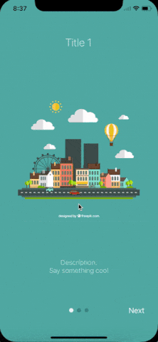
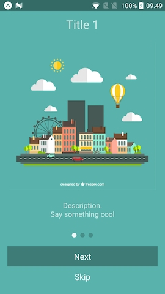

<h1 align="center">react-native-app-intro-slider</h1>

<p align="center">Easy-to-use yet very configurable app introduction slider/swiper</p>

```sh
npm i react-native-app-intro-slider --save
```

| | |
|-|-|
 | 

## Table of contents
  * [Usage](#usage)
    * [Basic Example](#basic-example)
    * [Configuring Buttons](#configuring-buttons)
    * [Custom Slide Layout](#custom-slide-layout)
  * [Props and options](#props-and-options)
    * [Configure behaviour](#configure-behaviour)
    * [Configure looks](#configure-looks)
  * [Example](#example)

<h2 align="center">Usage</h2>

### Basic example
| No configuration | `showSkipButton` | `bottomButton` and `showSkipButton`
|-|-|-|
||

```javascript
import React from 'react';
import { StyleSheet } from 'react-native';
import AppIntroSlider from 'react-native-app-intro-slider';

const styles = StyleSheet.create({
  image: {
    width: 320,
    height: 320,
  }
});

const slides = [
  {
    key: 'somethun',
    title: 'Title 1',
    text: 'Description.\nSay something cool',
    image: require('./assets/1.jpg'),
    imageStyle: styles.image,
    backgroundColor: '#59b2ab',
  },
  {
    key: 'somethun-dos',
    title: 'Title 2',
    text: 'Other cool stuff',
    image: require('./assets/2.jpg'),
    imageStyle: styles.image,
    backgroundColor: '#febe29',
  },
  {
    key: 'somethun1',
    title: 'Rocket guy',
    text: 'I\'m already out of descriptions\n\nLorem ipsum bla bla bla',
    image: require('./assets/3.jpg'),
    imageStyle: styles.image,
    backgroundColor: '#22bcb5',
  }
];

export default class App extends React.Component {
  _onDone = () => {
    // User finished the introduction. Show "real" app
  }
  render() {
    return (
      <AppIntroSlider
        slides={slides}
        onDone={this._onDone}
      />
    );
  }
}
```

### Configuring buttons


```javascript
import React from 'react';
import { Ionicons } from '@expo/vector-icons';
import { StyleSheet, View } from 'react-native';
import AppIntroSlider from 'react-native-app-intro-slider';

const styles = StyleSheet.create({
  buttonCircle: {
    width: 40,
    height: 40,
    backgroundColor: 'rgba(0, 0, 0, .2)',
    borderRadius: 20,
    justifyContent: 'center',
    alignItems: 'center',
  },
  image: {
    width: 320,
    height: 320,
  }
});

// slides = [...]

export default class App extends React.Component {
  _renderNextButton = () => {
    return (
      <View style={styles.buttonCircle}>
        <Ionicons
          name="md-arrow-round-forward"
          color="rgba(255, 255, 255, .9)"
          size={24}
          style={{ backgroundColor: 'transparent' }}
        />
      </View>
    );
  }
  _renderDoneButton = () => {
    return (
      <View style={styles.buttonCircle}>
        <Ionicons
          name="md-checkmark"
          color="rgba(255, 255, 255, .9)"
          size={24}
          style={{ backgroundColor: 'transparent' }}
        />
      </View>
    );
  }
  render() {
    return (
      <AppIntroSlider
        slides={slides}
        renderDoneButton={this._renderDoneButton}
        renderNextButton={this._renderNextButton}
      />
    );
  }
}
```

### Custom slide layout


```js
import React from 'react';
import { Ionicons } from '@expo/vector-icons';
import { StyleSheet, View, Text, Image } from 'react-native';
import { LinearGradient } from 'expo';
import AppIntroSlider from 'react-native-app-intro-slider';

const styles = StyleSheet.create({
  mainContent: {
    flex: 1,
    alignItems: 'center',
    justifyContent: 'space-around',
  },
  image: {
    width: 320,
    height: 320,
  },
  text: {
    color: 'rgba(255, 255, 255, 0.8)',
    backgroundColor: 'transparent',
    textAlign: 'center',
    paddingHorizontal: 16,
  },
  title: {
    fontSize: 22,
    color: 'white',
    backgroundColor: 'transparent',
    textAlign: 'center',
    marginBottom: 16,
  }
});

const slides = [
  {
    key: 'somethun',
    title: 'Quick setup, good defaults',
    text: 'React-native-app-intro-slider is easy to setup with a small footprint and no dependencies. And it comes with good default layouts!',
    icon: 'ios-images-outline',
    colors: ['#63E2FF', '#B066FE'],
  },
  {
    key: 'somethun1',
    title: 'Super customizable',
    text: 'The component is also super customizable, so you can adapt it to cover your needs and wants.',
    icon: 'ios-options-outline',
    colors: ['#A3A1FF', '#3A3897'],
  },
  {
    key: 'somethun2',
    title: 'No need to buy me beer',
    text: 'Usage is all free',
    icon: 'ios-beer-outline',
    colors: ['#29ABE2', '#4F00BC'],
  },
];

export default class App extends React.Component {
  _renderItem = props => (
    <LinearGradient
      style={[styles.mainContent, {
        paddingTop: props.topSpacer,
        paddingBottom: props.bottomSpacer,
        width: props.width,
        height: props.height,
      }]}
      colors={props.colors}
      start={{x: 0, y: .1}} end={{x: .1, y: 1}}
    >
      <Ionicons style={{ backgroundColor: 'transparent' }} name={props.icon} size={200} color="white" />
      <View>
        <Text style={styles.title}>{props.title}</Text>
        <Text style={styles.text}>{props.text}</Text>
      </View>
    </LinearGradient>
  );

  render() {
    return (
      <AppIntroSlider
        slides={slides}
        renderItem={this._renderItem}
        bottomButton
      />
    );
  }
}
```
Here a custom `renderItem` is supplied and the `bottomButton`-props has been set to `true`. Notice how the setup of `slides` has been configured to support icons and gradient backgrounds.

<h2 align="center">Props and options</h2>

### Configure looks

Name             | Type       | Default                   | Description
-----------------|------------|---------------------------|--------------
skipLabel        | `string`   | `Skip`                    | Custom label for Skip button
doneLabel        | `string`   | `Done`                    | Custom label for Done button
nextLabel        | `string`   | `Next`                    | Custom label for Next button
bottomButton     | `boolean`  | `false`                   | Enable to show a full-width button under pagination
dotColor         | `string`   | 'rgba(0, 0, 0, .2)'       | Color of inactive pagination dots
activeDotColor   | `string`   | 'rgba(255, 255, 255, .9)' | Color of active pagination dot
renderNextButton | `function` | renders a Text-component  | Use to supply your own next button
renderDoneButton | `function` | renders a Text-component  | Use to supply your own done button
renderItem       | `function` | renders `DefaultSlide`    | Function returning a slide. The function is passed the slide object as wells as `{ topSpacer: Number, bottomSpacer: Number }`. These show the "safe-space" where other UI is not interfering - take a look at `DefaultSlide.js` too see how they are set up.

### Configure behavior

Name             | Type       | Default                   | Description
-----------------|------------|---------------------------|--------------
slides           | `object`   | No default, required      | An array of [slide-objects](#slide-object)
showSkipButton   | `boolean`  | `false`                   | Enable to show a skip button to the left of pagination dots. When `bottomButton == true` the skip button is a small text under the full-width next button
onSlideChange    | `function` | `void`                    | Called when user goes to next slide. Function called with arguments `index: number, lastIndex: number`
onDone           | `function` | `void`                    | Called when user ends the introduction by pressing the done button
onSkip           | `function` | `void`                    | Called when user presses the skip button

#### slide object
Each slide object should contain at least a unique `key`. If you use the default layouts your object should furthermore contain:

Name             | Type                | Note           
-----------------|---------------------|---------------------
title            | `string`            | The title
text             | `string`            | Main text of slide
image            | `Image`-source prop | Slide image
imageStyle       | `Style`-prop        | Styling for the image (e.g. size)
backgroundColor  | `string`            | Slide background color

If you use a custom `renderItem`-method you can design your slide objects as you see fit.

<h2 align="center">Example</h2>

You can run the example Expo-app by cloning the repo:


```sh
git clone https://github.com/Jacse/react-native-app-intro-slider.git
cd react-native-app-intro-slider/Example
yarn
yarn start
```
